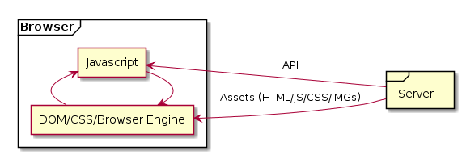
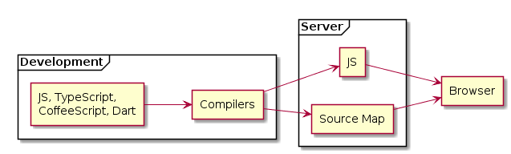

# Browsers

---

 <!-- .element: class="stretch" -->

---

## In the Engines

* Document Object Model (DOM)
* ECMAscript.
* CSS

^^^

This is all there is in the browser side.

Server can only communicate by sending data or scripts.

^^^

You can use any language on the server
as long as it can write string that looks like HTML/JS/CSS.

---

## Document Object Model (DOM)

* The live state of the Document.
  * HTML is just a template for initial DOM.
* Access to Browser functionalities.

^^^

### Browser Functionality

* Local Storage / IndexDB
* Custom Component / Shadow DOM
* pushState
* fetch
* web worker

---

## (Some) ECMAScript

* The only language (partially) understood by the browser.
* Control the behavior of a web page.
* Query and modified DOM state.

---

## CSS Styling

* Globally Casecading Style Sheet
* Native styling language.
* Media Query
* Animation

```html
<style>
  /* Everything here applies to the whole page*/
  .some-class {
    background: red;
  }
</style>
```

---

### These are all that the browsers actually understand.

---

### Wait, only SOME JS?

```html
<script src="script1.js" />  <!-- no concept -->
<script src="script2.js" />  <!-- of modules -->
```


```javascript
import _ from 'lodash'                 // WHAT
const x = {                            // THE
  [`key_${Math.rand()}`]: _.uniqueId() // ACTUAL
}                                      // F*$K
let req = async (url, args) => {       // IS
  return await fetch(url, ...args);    // THIS
}                                      // SYNTAX?!!?
class Person { }          // I am IE11, by the way
```

---

* Standard changes, not the browser.
* **Babel** transpiles language to the target environment.
* **Webpack** packages files into single file.
  * It actually does other things like packaging CSS and
    other assets as well

---

 <!-- .element: class="stretch" -->

^^^

## What about NodeJS?

* JS outside the browser.
* You can write server in it.
* All server rules still apply.
